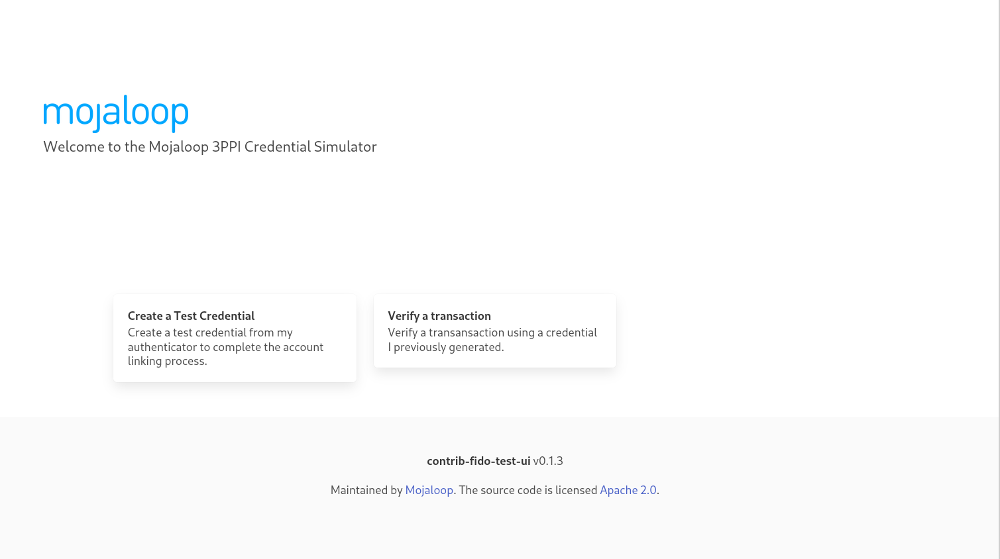
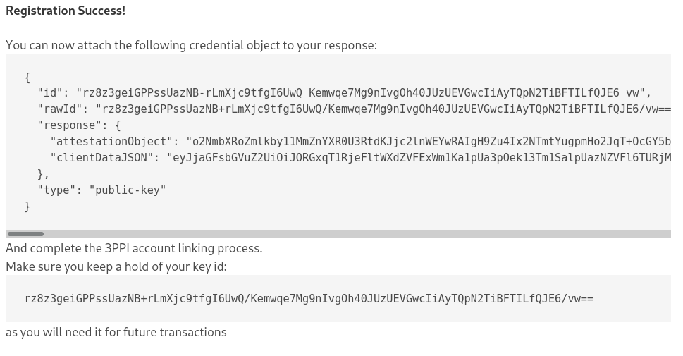
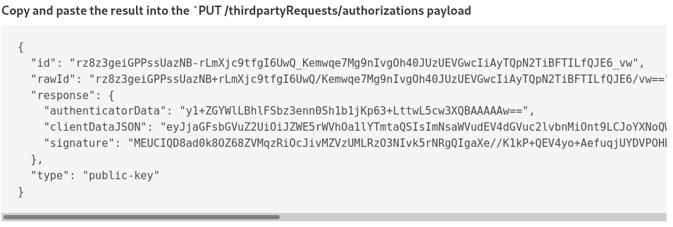

# FIDO Test UI

Easily generate test FIDO credentials for the Mojaloop Third Party API

**See It Live**
This project is deployed live on the Mojaloop Sandbox at [sandbox.mojaloop.io/fido](http://sandbox.mojaloop.io/fido)


## Running Locally

```bash
npm run dev
# Now go to the url it says!
```

## Creating a Test Credential

In order to complete the Third Party API Account Linking process, you 
must create a Credential object to attach to the Consent issued by a
DFSP. 

Read more about the [Third Party API Account Linking process](http://sandbox.mojaloop.io/guides/overlay/g2p-3ppi-account-linking.html)

Since real FIDO credentials requires interaction with an end user, it's
hard to create test credentials to try out the Third Party API or write
automated end to end tests.

Either run this project locally, or go to [sandbox.mojaloop.io/fido/create_credential](http://sandbox.mojaloop.io/fido/create_credential)
to create your test credential.

At the end of the process, you will be provided a credential object, which
you can send to the DFSP in `PUT /consents/{ID}` (or `POST /linking/request-consent/{ID}/pass-credential`
if you are using the sync Thirdparty SDK)




## Using a Test Credential

Once you have registered your credential, you can use it to sign 3PPI
Transaction Requests. Read more about the [Third Party API Transfer Process](http://sandbox.mojaloop.io/guides/payments/3ppi-p2p.html)

Either run this project locally, or go to [sandbox.mojaloop.io/fido/verify_transaction](http://sandbox.mojaloop.io/fido/verify_transaction).

Copy and paste the challenge field from the `POST /thirdpartyRequests/authorizations` 
request from the DFSP (or in the response to `POST /thirdpartyTransaction/{ID}/initiate` if
you are using the sync Thirdparty SDK)

Then paste in the credentialId of the credential you previously registered. This field
may be pre-filled for you if you recently created the credential.

Click "Submit" to complete the FIDO Assertion flow and copy the FIDO Assertion Result,
which you can send to the DFSP in `PUT /thirdpartyRequests/authorizations/{ID}` (or
`POST /thirdpartyTransaction/{ID}/approve` if you are using the sync Thirdparty SDK)



## Tested on:

- YubiKey on Firefox with Linux
- TouchId on Chrome with M1 Macbook Air
> Have you managed to get it working! Please add to this list!